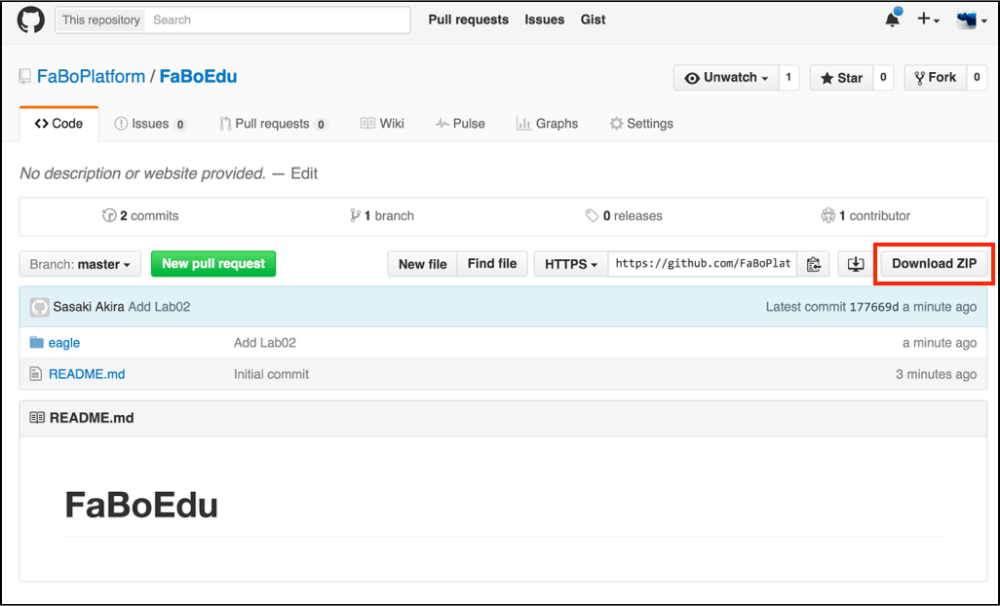
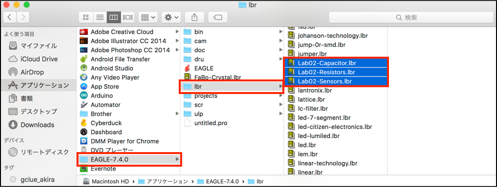
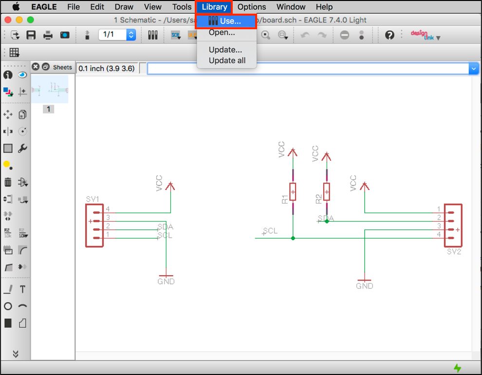
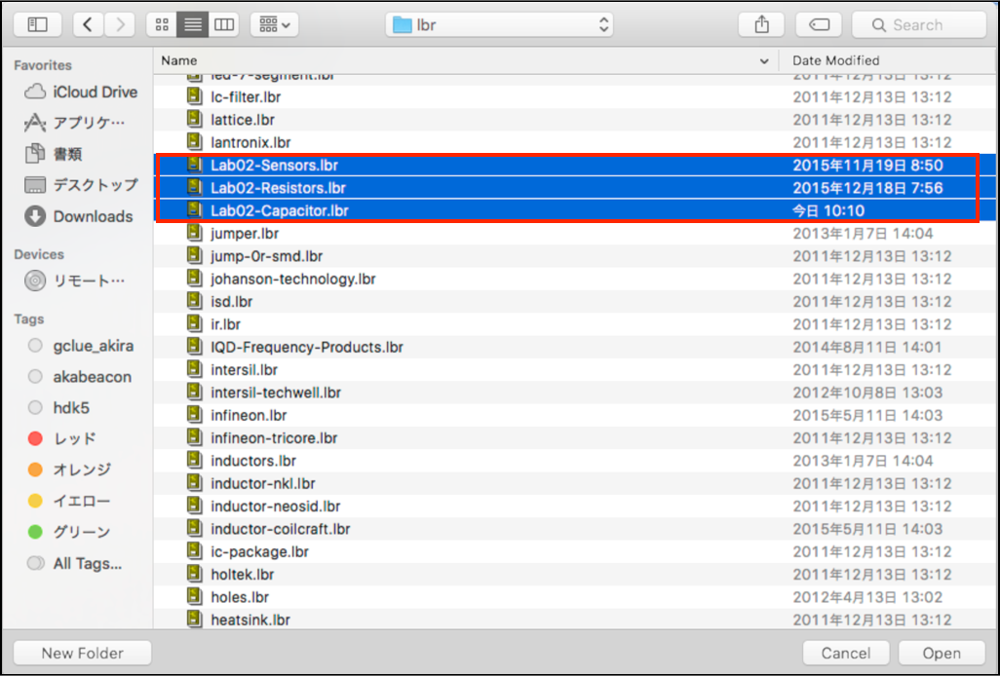
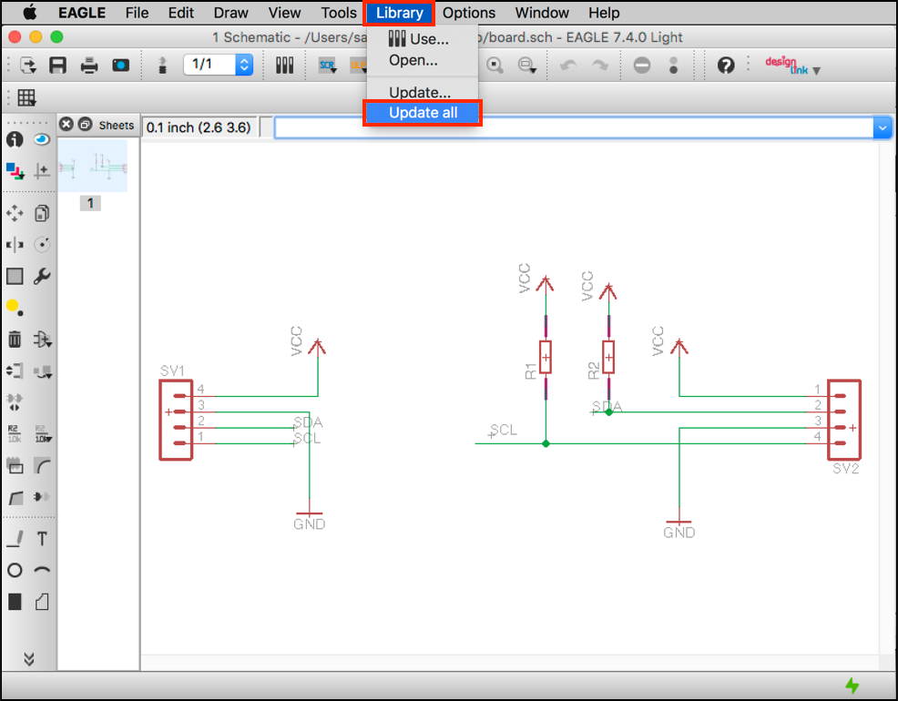

# Lab01

## Lab01で使用するライブラリ

| ライブラリ名 | フォルダ |
|  -- | -- | 
| Lab02-Sensors.lbr | FaBoEdu¥eagle¥ |
| Lab02-Capacitor.lbr | FaBoEdu¥eagle¥ |
| Lab02-Resistor.lbr | FaBoEdu¥eagle¥ |

Lab02では、I2Cの表面実装センサーを追加します。

## Lab02.lbrの取り込み

Githubの下記のRepoをローカルにダウンロードしてきます。

[https://github.com/FaBoPlatform/FaBoEdu](https://github.com/FaBoPlatform/FaBoEdu)

Lab02-Sensors.lbr,Lab02-Capacitor.lbr,Lab02-Resistor.lbr を、Eagleのlbrフォルダにコピーします。

EagleのメニューにLibrary>Use...を選択し、Lab02-Sensors.lbr,Lab02-Capacitor.lbr,Lab02-Resistor.lbrを選択します。

EagleのメニューにLibrary>Update Allを選択し、Lab02-Sensors.lbr,Lab02-Capacitor.lbr,Lab02-Resistor.lbrを取り込みます。

これでLab02の準備は完了です。