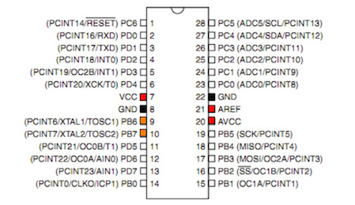
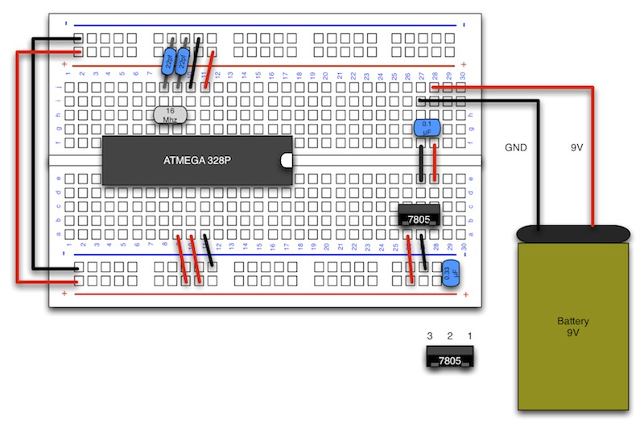

# 水晶発信子の接続

#### ここで使用するもの

水晶発信子(16MHz)
 
http://akizukidenshi.com/catalog/g/gP-08671/

セラミックコンデンサ 22pF
 
http://akizukidenshi.com/catalog/g/gP-03620/

 

#### 説明

**・水晶発信子**
 
電気を流す事でクロック信号を出力する素子。
オレンジの部分に水晶発信子を接続します。

#### 配線図

