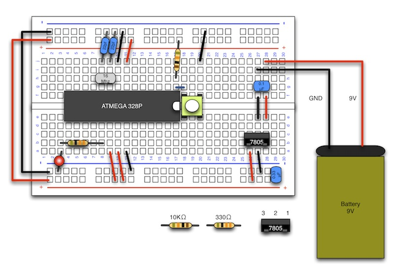

# リセットスイッチの実装

#### ここで使用するもの

抵抗　10KΩ　（カラー：茶黒橙金）
 
http://akizukidenshi.com/catalog/g/gR-25103/

タクトスイッチ
 
http://akizukidenshi.com/catalog/g/gP-02561/

 

#### 説明

緑の部分がリセット端子になります。
 

 
#### 配線図

