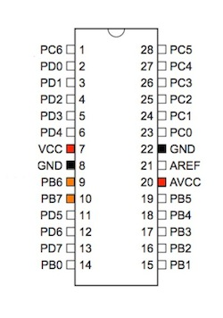
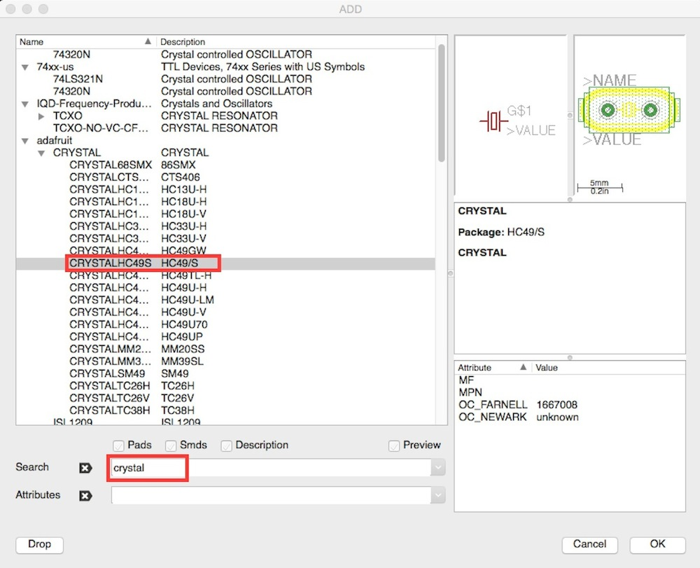
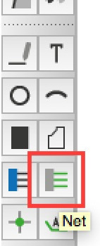
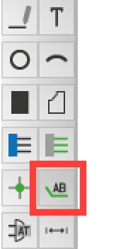
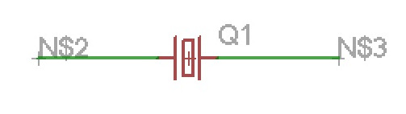
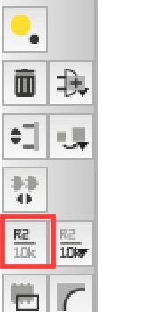
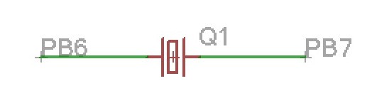
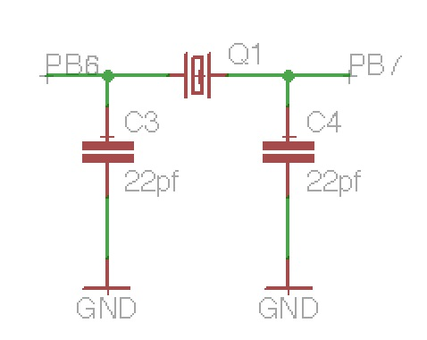

# 水晶発信子の配置

水晶発振子を取り付けます。
 

 

ツールバーの「Add」より水晶発振子を選択します。
 

 

選択した部品を配置します。
 

 

水晶発信子の両側の線を伸ばします。
 
ツールバーより「Net」を選択します。
 

 

水晶発信子の左右に線を引きます。
 

 

表示用のラベルを追加します。
 
ツールバーより「Label」を選択します。
 

 

左右のそれぞれの線に対してラベルを追加します。
 

 
追加した線の名称の変更をします。
 
ツールバーより「Name」を選択します。
 

 

左右の線の名称を「PB6」「PB7」に変更します。
 

 

コンデンサとGNDを追加します。
 
どちらも既に配置済みですので、コピーして配置します。
 

