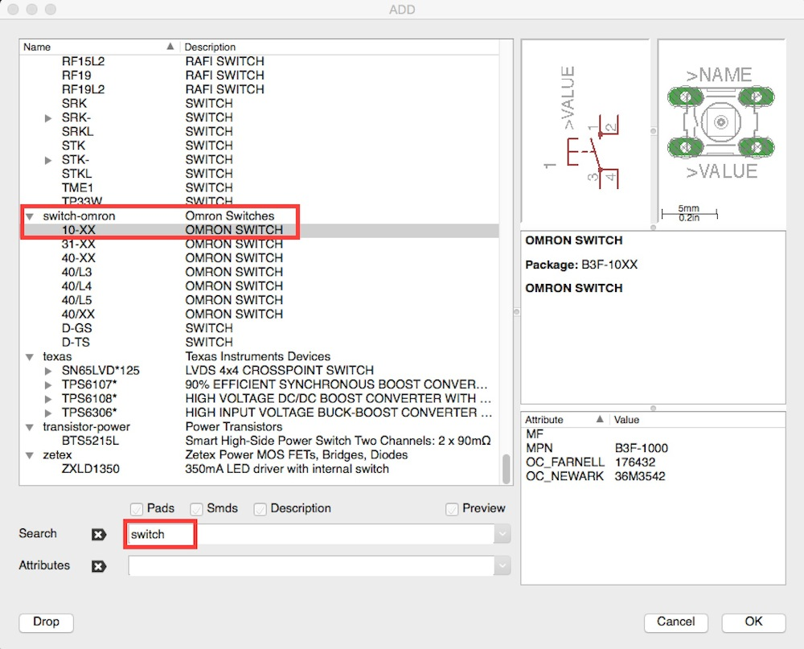
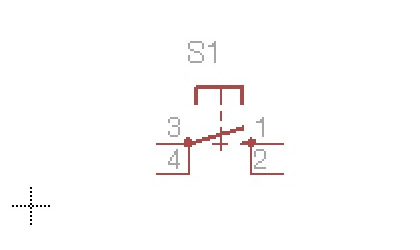
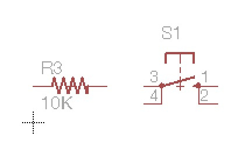
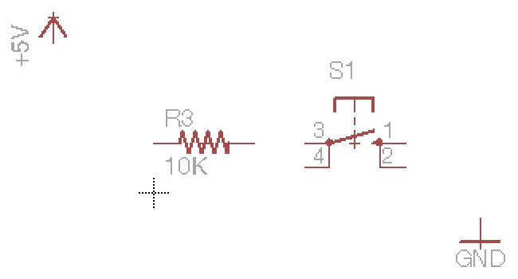
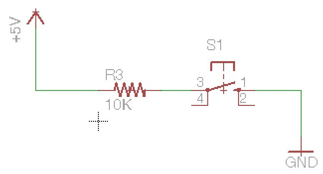
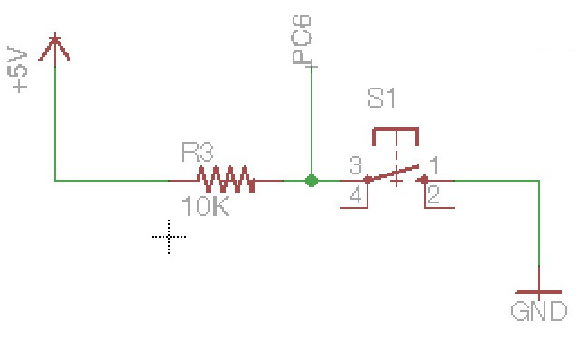
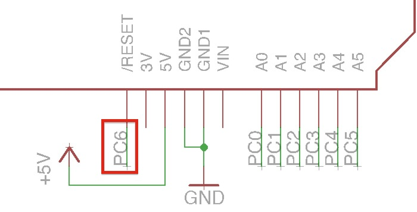
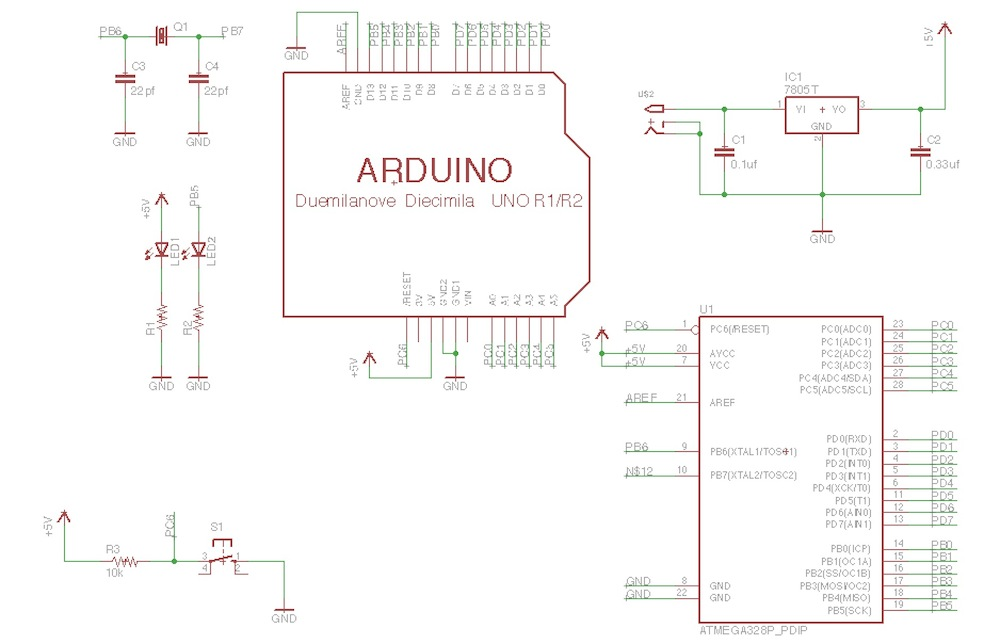

# リセット機能

リセット機能を作成します。

ツールバーの「Add」より「switch」を選択します。
 

 

ある程度の広さの場所を確保し、スイッチを配置します。
 

 

抵抗を配置し、ツールバーの「Value」より値を「10k」に変更します。
 

 

ツールバーの「Copy」を選択し、配置済みの「+5V」「GND」をコピーして配置します。
 

 

「+5V」、抵抗、スイッチ、GNDに対して線を引きます。
 

 

抵抗とスイッチの間に線を引き、名称を「PC6」に変更します。
 

 

次に基板側のリセット回路への接続を行います。
 
基板の左下にある「RESET」から線を伸ばし、名前を「PC6」に変更します。
 
これで接続完了です。
 

 

これまで作成したものの全体図です。
 

 

