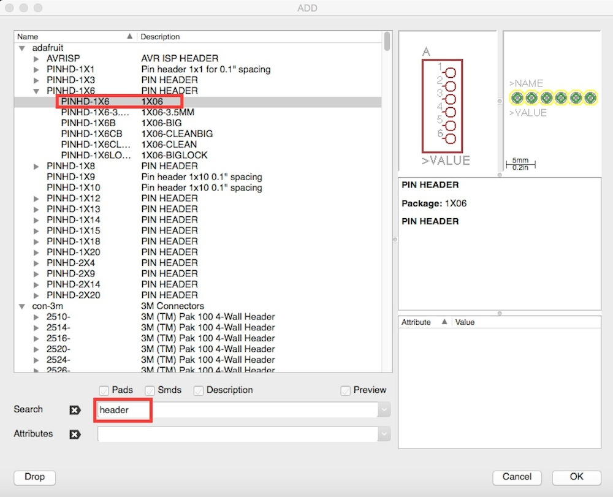
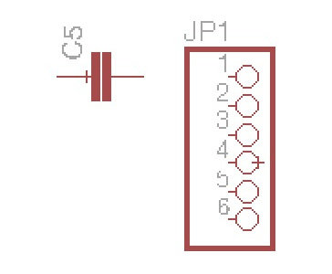
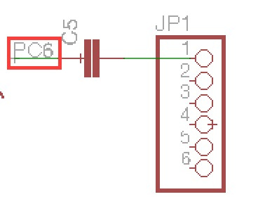
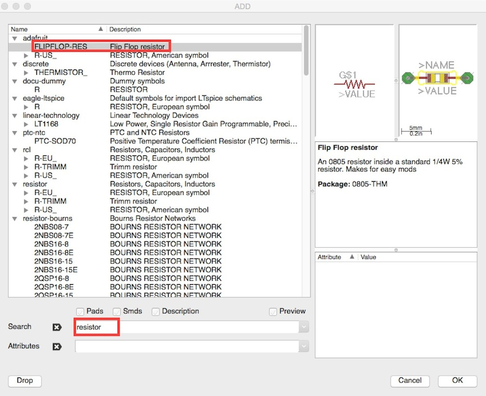
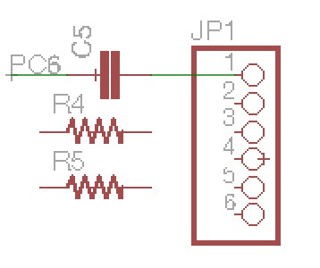
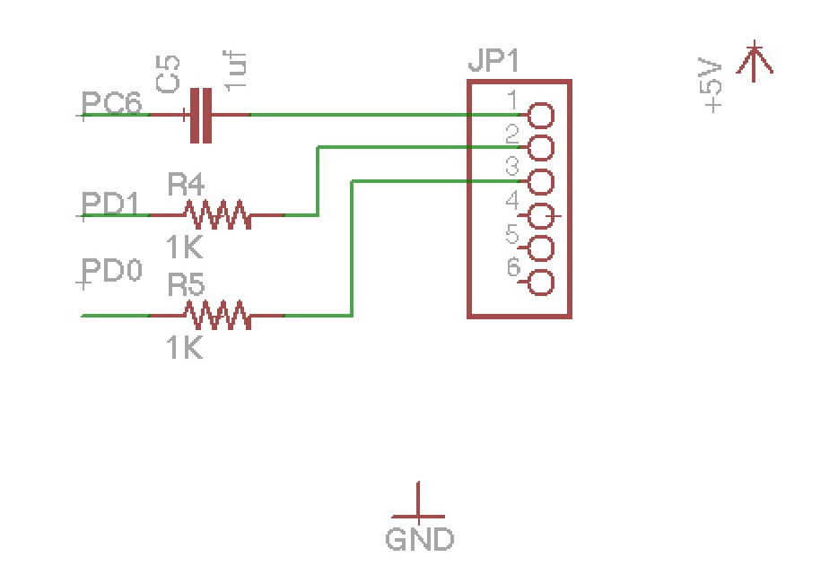
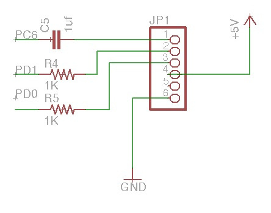
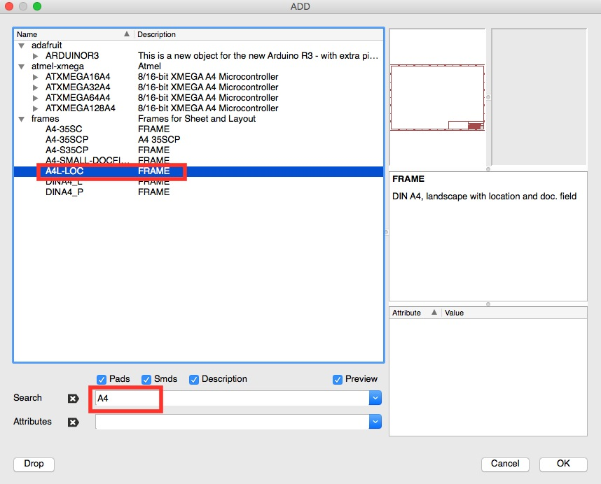
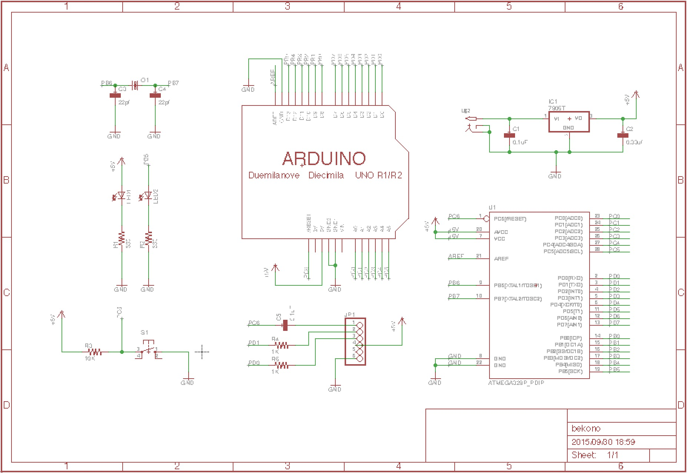

# USBシリアル変換アダプタの配置

USB-シリアル変換ボードでの転送用ピンを作成します。
 
ツールバーの「Add」よりコンデンサを選択します。
 
コピーで作成しても構いません。
 

 
次に転送用のピンヘッダーを選択します。
 

 

それぞれ部品を下の様に配置します。
 

 

「Net」にて配線を行い、コンデンサの左の線を「PC6」に変更します。
 

 

「Add」より抵抗を選択します。
 

 

コンデンサの下側に２つ配置し、名前をそれぞれ変更します。
 

 

転送用ピンと部品を線で繋ぎ、抵抗の左側にある線の名前を変更します。
 
配線が終わったら「+5V」と「GND」を追加します。
 

 

「+5V」を転送用ピンの4番、「GND」を6番に配線します。
 
4番目のピンは、◯の左側まで線を引かないと正しく配線されないので注意して下さい。
 

 

これで回路図の作成は終了ですが、最後に外枠を設定します。
 
ツールバーの「Add」より「A4L-LOC」を選択します。
 

 
配置するとこのような形になります。

