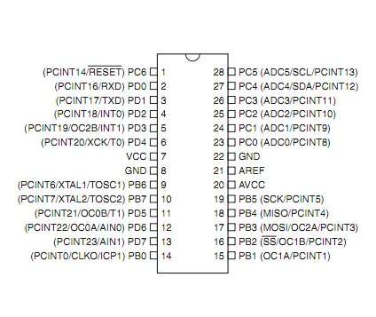
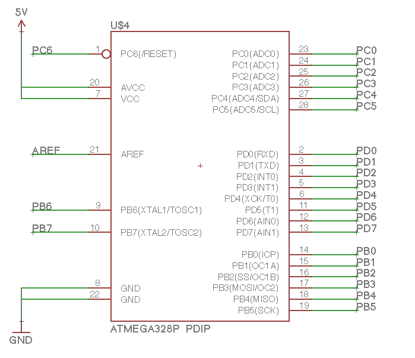

# ICの配置

Arduino Unoで使用されている「ATMEGA328P」を配置します。

ATMEGA328P
 
[データシート](
http://www.atmel.com/images/Atmel-8271-8-bit-AVR-Microcontroller-ATmega48A-48PA-88A-88PA-168A-168PA-328-328P_datasheet_Complete.pdf)

## 回路図

## ATMEGA328の配置

YouTube動画 https://www.youtube.com/watch?v=5_Sujyv-vhk

